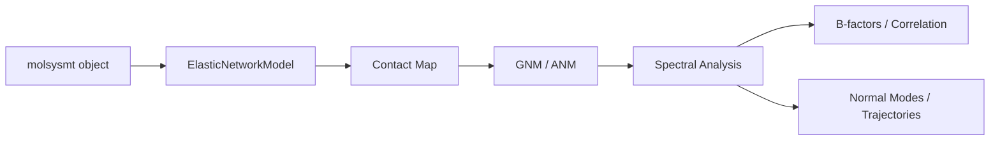

# Architecture

This document describes the structural and data-flow design of **ElastNetMT**.

## Class Hierarchy

To ensure consistency and reduce code duplication, the library follows a hierarchical model:

1.  **`ElasticNetworkModel` (Base Class):**
    -   Handles general inputs via `molsysmt`.
    -   Calculates the **Contact Map** (adjacency matrix).
    -   Manages common selection logic (e.g., `atom_name=="CA"`).
    
2.  **`GaussianNetworkModel` (GNM):**
    -   Specializes in **isotropic** fluctuations.
    -   Builds the **Kirchhoff Matrix**.
    -   Focuses on B-factor prediction and cross-correlations.

3.  **`AnisotropicNetworkModel` (ANM):**
    -   Specializes in **directional** motions.
    -   Builds the **Hessian Matrix**.
    -   Calculates normal mode vectors for trajectory generation.

## Data Flow

## Lazy Evaluation Pattern

To optimize performance, ElastNetMT objects are initialized in a **dormant state**.

1.  **Instantiation:** Only inputs (`molecular_system`, `selection`, `cutoff`) are stored.
2.  **Contact Map:** Calculated only when needed for the Kirchhoff/Hessian construction.
3.  **Spectral Solution:** Triggered only by a data request (e.g., `get_eigenvalues()`).
4.  **Persistence:** Results are cached internally until parameters (`cutoff`, `selection`) are changed.

## Private Modules Strategy

Following the MolSysSuite standard, internal logic is moved to `_private/`:
- `_private/contacts.py`: Vectorized contact calculations.
- `_private/variables.py`: Shared utilities.
- `_private/smonitor/`: Diagnostic signals and exceptions.
